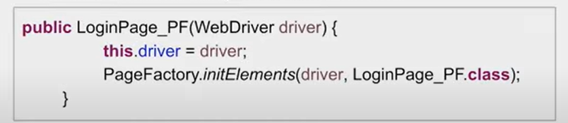

## Selenium Cucumber Java BDD Framework
 
* ### Selenium Cucumber Java BDD Framework 1 - Setup

      Step 1 : Create a new Maven Project

      Step 2 : Add Maven Dependencies

               Cucumber Java | Cucumber JUnit | JUnit | Selenium Java

      Step 3 : Create a Folder - Features under src/test/resources

      Step 4 : Under Features folder create a new Feature File - login.feature

      Step 5 : Install Cucumber for Java Plugin from File--> Settings--> Plugins--> Cucumber for Java--> Install--> Apply and Ok

      Step 6 : Create feature file and add Contents
               Contents in feature file :
               - Feature
               - Scenario
               - Steps
               - Scenario Outline
               - Example
               - Tags
               - Comments

      Step 7 : Try to run the feature file
     
      Step 8 : Add Step Definitions/Glue Code under src/test/java package

      Step 9 : Create a Runner Class
  
      Step 10 : Create Add Cucumber Options for generating reports
 
                HTML | JSON | JUNIT / XML

      Step 11 : Run and Verify Results

* ### Selenium Cucumber Java BDD Framework 2 - First Selenium Test

      Step 1 : Add Selenium Java Maven dependency

      Step 2 : Create a feature file and add Scenario and Steps

      Step 3 : Create Step Definition/Glue Code for the steps

      Step 4 : Download browser driver files

      Step 5 : Add Selenium WebDriver code

      Step 6 : Run Feature file and check the execution

* ### Selenium Cucumber Java BDD Framework 3 - Sample Login Test

      Step 1 : Check the scenario/navigation

      Step 2 : Create a feature file and add Scenario and Steps

      Step 3 : Create Step Definition/Glue Code for the steps
 
      Step 4 : Add Selenium WebDriver code

      Step 5 : Run Feature file and check the execution

* ### Selenium Cucumber Java BDD Framework 4 - Parameterization & Data Driven Testing

      Step 1 : In the feature file select the values that needs to be parameterized

      Step 2 : Put the values within conical brackets or double quotes (Parameterization)

      Step 3 : Change Scenario to Scenario Outline

      Step 4 : Add Examples section

      Step 5 : Add data for the parameters in the Examples section

      Step 6 : Update step definition to get values from feature file Examples section

      Step 7 : Run Feature file and check the execution

* ### Selenium Cucumber Java BDD Framework 5 - Page Object Model

   

   

 **Steps to Implement POM :** 

      Step 1 : Create a Class for each page

      Step 2 : Create locators of all objects to be used in that page using By Class
      
      Step 3 : Create methods or actions to be performed on the objects

      Step 4 : Refer in the test scripts

      Step 5 : Run and Validate

* ### Selenium Cucumber Java BDD Framework 6 - Page Factory

**Steps to Implement Page Factory Model :** 

      Step 1 : Create a Class for each page

      Step 2 : Create locators of all objects to be used in that page using @FindBy annotation
      
      Step 3 : Create methods or actions to be performed on the objects

      Step 4 : Create constructor to get driver instance and initialize elements using method initElements

      Step 5 : Update Test Scripts to refer methods from PageFactory class
      
      Step 6 : Run and Validate

* ### Selenium Cucumber Java BDD Framework 7 - Tags

      Step 1 : Create a Class for each page

      Step 2 : Create locators of all objects to be used in that page using @FindBy annotation
      