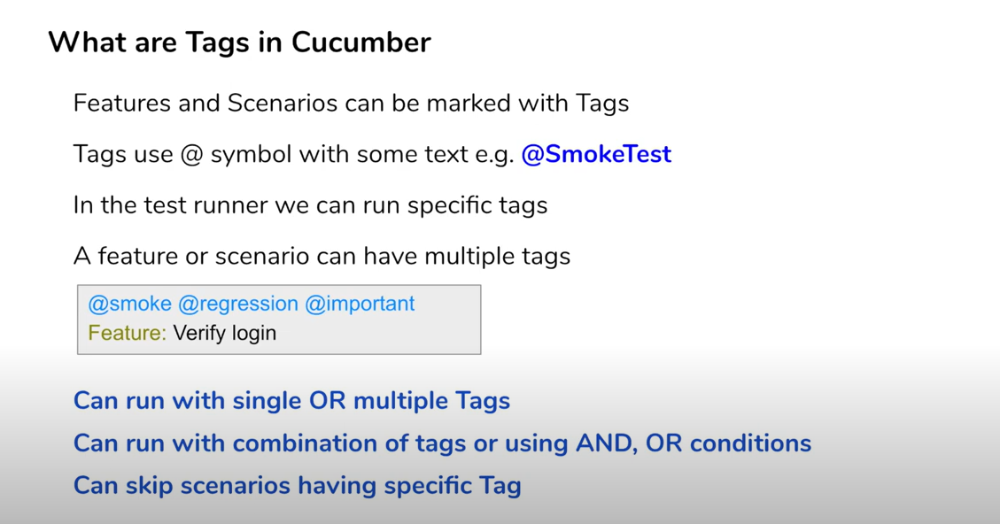
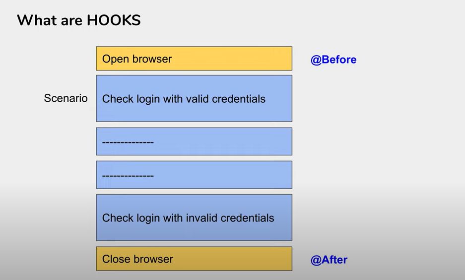
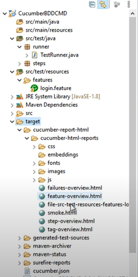

# Selenium Cucumber Java BDD Framework

* ## Selenium Cucumber Java BDD Framework 1 - Setup

      Step 1 : Create a new Maven Project

      Step 2 : Add Maven Dependencies

               Cucumber Java | Cucumber JUnit | JUnit | Selenium Java

      Step 3 : Create a Folder - Features under src/test/resources

      Step 4 : Under Features folder create a new Feature File - login.feature

      Step 5 : Install Cucumber for Java Plugin from File--> Settings--> Plugins--> Cucumber for Java--> Install--> Apply and Ok

      Step 6 : Create feature file and add Contents
               Contents in feature file :
               - Feature
               - Scenario
               - Steps
               - Scenario Outline
               - Example
               - Tags
               - Comments

      Step 7 : Try to run the feature file
     
      Step 8 : Add Step Definitions/Glue Code under src/test/java package

      Step 9 : Create a Runner Class
  
      Step 10 : Create Add Cucumber Options for generating reports
 
                HTML | JSON | JUNIT / XML

      Step 11 : Run and Verify Results

* ## Selenium Cucumber Java BDD Framework 2 - First Selenium Test

      Step 1 : Add Selenium Java Maven dependency

      Step 2 : Create a feature file and add Scenario and Steps

      Step 3 : Create Step Definition/Glue Code for the steps

      Step 4 : Download browser driver files

      Step 5 : Add Selenium WebDriver code

      Step 6 : Run Feature file and check the execution

* ## Selenium Cucumber Java BDD Framework 3 - Sample Login Test

      Step 1 : Check the scenario/navigation

      Step 2 : Create a feature file and add Scenario and Steps

      Step 3 : Create Step Definition/Glue Code for the steps
 
      Step 4 : Add Selenium WebDriver code

      Step 5 : Run Feature file and check the execution

* ## Selenium Cucumber Java BDD Framework 4 - Parameterization & Data Driven Testing

      Step 1 : In the feature file select the values that needs to be parameterized

      Step 2 : Put the values within conical brackets or double quotes (Parameterization)

      Step 3 : Change Scenario to Scenario Outline

      Step 4 : Add Examples section

      Step 5 : Add data for the parameters in the Examples section

      Step 6 : Update step definition to get values from feature file Examples section

      Step 7 : Run Feature file and check the execution

* ## Selenium Cucumber Java BDD Framework 5 - Page Object Model

   

   

### Steps to Implement POM :

      Step 1 : Create a Class for each page

      Step 2 : Create locators of all objects to be used in that page using By Class
      
      Step 3 : Create methods or actions to be performed on the objects

      Step 4 : Refer in the test scripts

      Step 5 : Run and Validate

* ## Selenium Cucumber Java BDD Framework 6 - Page Factory

### Steps to Implement Page Factory Model :

      Step 1 : Create a Class for each page

      Step 2 : Create locators of all objects to be used in that page using @FindBy annotation
      
      Step 3 : Create methods or actions to be performed on the objects

      Step 4 : Create constructor to get driver instance and initialize elements using method initElements

      Step 5 : Update Test Scripts to refer methods from PageFactory class
      
      Step 6 : Run and Validate

* ## Selenium Cucumber Java BDD Framework 7 - Tags

      Step 1 : Create a new or use an existing Feature file

      Step 2 : Mark the feature and scenarios with Tags : @TagName

      Step 3 : Create new or use an existing TestRunner Class

      Step 4 : Add the tags in CucumberOptions section
      
      @RunWith(Cucumber.class)
      @CucumberOptions(features = "src/test/resources/Features", 
      glue= {"StepDefinitions"},
      monochrome = true,
      tags = {"@RegressionTest"}
      )
      public class TestRunner_RunWithSingleTag {
      }

      Step 5 : Run test runner class with different combination of tags
      
      - Single Tag -> tags={"@smoke"}

      - Multiple Tags -> Tags with AND/OR conditions
      tags={"@smoke or @regression"}
      tags={"@smoke and @regression"}
      tags={"@smoke or @regression and @important"}
      tags={"(@smoke or @regression) and @important"}

      - Skip or Ignore Tests -> Using not
      tags={"@smoke and not @regression"}

### mvn test -Dcucumber.filter.tags="@smoke and @fast"

* ## Selenium Cucumber Java BDD Framework 8 - Hooks

## Why to use HOOKS ??

 ### - To manage the setup and tear down
 ### - To avoid re-writing the common setup or teardown actions
 ### - Allow better management of code workflow

## When to use HOOKS ??

 ### Whenever you have some common setup and teardown actions to be executed 
 ### before each scenario then we use hooks.

## How to use HOOKS ??

      Step 1 : Create a new or use an existing Feature file

      Step 2 : Create the steps for the scenario in the feature file

      Step 3 : Create setup and teardown methods and mark with annotation
               @Before       @BeforeSteps
               @After        @AfterSteps

**import io.cucumber.java.After;**

**import io.cucumber.java.AfterStep;**

**import io.cucumber.java.Before;**

**import io.cucumber.java.BeforeStep;**

### So, these functions have become hooks and will be executed before and after every scenario in the feature

### Using @BeforeStep and @AfterStep, these hooks will be executed before and after each step

       Step 4 : Create new or use an existing TestRunner Class
      
       Step 5 : Run the TestRunner class and check execution

### Ordering of HOOKS : Manage Execution Order of Hooks

**By Default, they will be executed in alphabetical order of method names but we can assign order to them**

### Tags with HOOKS - Conditional HOOKS

**@Before("@smoke")**

**@Before(value = "@smoke", order = 1)**

* ## Selenium Cucumber Java BDD Framework 9 - Background

## What is Background ??

### - A step or a group of steps that are common to all the scenarios in a feature
### - Is Defined once in the feature
### - Runs before every scenario of the feature

## Why to use Background ??

### - To avoid repeating the common steps in every scenario
### - For better readability & maintenance
### - Unlike hooks,background is visible to the readers of the feature file

## When to use Background ??

### - Whenever there are common repeating steps in a feature
### - When you want the common steps to be visible to the readers

## How to use BACKGROUND ??

      Step 1 : Create a new or use an existing Feature file

      Step 2 : Create the steps for the scenario in the feature file

      Step 3 : Create new or use an existing TestRunner Class

      Step 4 : Run the test runner file

      Step 5 : Create a background section and add common steps
 
      Step 6 : Run the test runner file and check execution of background

* ## Selenium Cucumber Java BDD Framework 10 - How to run from Command Line

## What is Command Line Execution ??

### - Running your tests or features from command line or terminal without using the IDE or GUI (Intellij etc.)

We can use command prompt on windows or terminal on mac for executing.

- Command Line on Windows
- Terminal on Mac
- Console

## Why to use Command Line ??

### - No Dependency on IDE or GUI
### - Useful in integrations with other processes like Continuous Integration, Delivery and Deployment
### - Easier and Faster
### - Consumes less memory

## When to use Command Line ??

### - Whenever you need to run the tests faster without opening IDE
### - Whenever you need to do integrations with other processes CI, CD, DevOps
### - Whenever using CI tools like Jenkins
### - Whenever you need any batch or scheduled execution
### - Whenever you are done with your test creation and setup

### Command Line - Step by Step

      Step 1 : Right Click on the project and select Run As -> Maven test

      Step 2 : Check the Console Logs

      Step 3 : Troubleshoot and correct the errors

      Step 4 : Open CMD Prompt

      Step 5 : Check MAVEN is installed mvn -version

      Step 6 : CD to the project location

      Step 7 : Run command mvn test

### Overriding Cucumber Options from Command Line

* ## Selenium Cucumber Java BDD Framework 11 - How To Create HTML Reports

## How to generate HTML Report

      Step 1 : Add the maven cucumber reporting dependency in pom.xml

      Step 2 : Add the build plugins in pom.xml

      Step 3 : Clean Project

      Step 4 : From command line run - mvn test

      Step 5 : From command line run - mvn verify

      Step 6 : Check report generated

